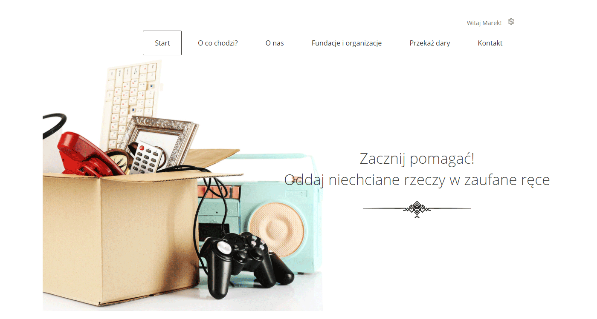

# Charity

## Pomysł na projekt. User story

Użytkownik ma w domu rzeczy, których nie używa, ale są one w dobrym stanie i chce przekazać je osobom, którym się mogą przydać - nie wie jednak jak w prosty sposób to zrobić.
Jest wiele dostępnych rozwiązań, ale wiele z nich wymaga dodatkowego wysiłku lub nie budzą one zaufania.
W zweryfikowane miejsca trzeba pojechać, a nie ma na to czasu lub nie ma jak tam pojechać. Natomiast kontenery pod domem lub lokalne zbiórki są niezweryfikowane i nie wiadomo czy te rzeczy faktycznie trafią do potrzebujących.

Powyższy opis wraz z layoutem w czystym HTMLu jest wsadem do wykonania aplikacji.

## Stan realizacji (co działa)

- Utworzenie zlecenia wysłania darów
  - Walidacja wprowadzanych danych przez atrybuty modelu oraz dodatkową logiką
- Wysłanie potwierdzenia zlecenia na email zarejestrowanego użytkownika
- Rejestracja użytkownika
- Potwierdzenie rejestacji (aktywacja konta) przez email z tokenem
- Edycja danych użytkownika
- Zmiana hasła
- Obsługa ponownego ustawienia hasła (reset hasła) przez email z tokenem
- Obsługa formularza kontaktowego
- Lista darów użytkownika (dla zarejestrowanego użytkownika)
- [Działające demo w chmurze Azure](https://drugie-zycie.azurewebsites.net)

Starałem się być DRY, więc widoki są poprzykrajane tak, żeby maksymalnie korzystać z widoków częściowych. Powtarzające się częsci kodu są wydzielone do osobnych modułów. Warstwy aplikacji są oddzielone od siebie zgodnie z podziałem odpowiedzialności MVC.

## Do dokończenia

- Administracja: ustawianie zleceniom flagi 'odebrane', blokada użytkownika itp.

## Użyte języki

- C#
- JavaScript
- HTML/CSS

## Frameworki i biblioteki

- .NET Core MVC
- .NET Core Identity
- Entity Framework (code first)
- Linq
- Azure Cloud (aplikacja i baza w chmurze)
- MailKit
- Serilog: logowanie do pliku, serwera syslog, bazy danych
- konfiguracja aplikacji w plikach .json
- Bootstrap

## Bazy danych

- MS SQL
- SQLite w chmurze

---
Jeśli chcesz o coś spytać, tu jest moja [wizytówka](https://www.adameczek.pl "My Homepage") z danymi kontaktowymi.
